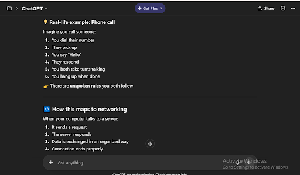
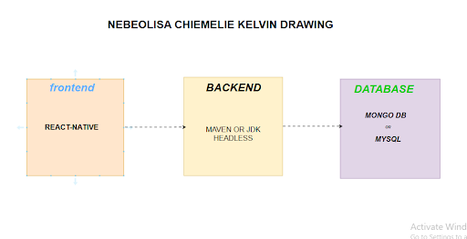
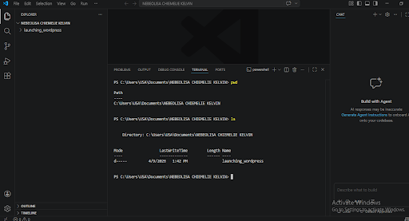

# Week 00 - Internet and Networking

Part of the DevOps Micro Internship (DMI) Cohort 3 with Agentic AI

---

# 🧑‍💻 Task 1: Using ChatGPT as Your Learning Assistant

## Scenario

You're new to DevOps and will frequently encounter technical questions. ChatGPT can be your learning companion.

## Your Task

Write a clear ChatGPT prompt to help you understand:

> "What is a protocol in networking? Explain with a simple real-life example."

Take a screenshot of your interaction showing:

* Your detailed prompt (with clear expectations)
* ChatGPT's simplified response with an example

## Screenshot

Save your screenshot in the `screenshots` folder and update the file name below.





---

## What I Learned (2–3 lines)

I learnt that protocol is a set of rules use for communication over the network
It is a laid down mode of interaction devices use to execute command just like humans use language to understand each other, devices need protocol to understand each command
---

# 🌐 Task 2: Internet and Networking

## Scenario

Your friend is launching an online bookstore named **EpicReads**.

He asked you to explain how users globally can access his website hosted in Finland.

## Your Task

Write a short explanation (**100–150 words**) that includes:

* Packet Switching
* IP Address
* TCP/IP
* HTTP/HTTPS

💡 **Tip:** You may use ChatGPT (as demonstrated in Task 1) to refine your explanation.

## Answer

 If you host EpicReads in Finland, people around the world can still access it because of how the internet is designed. When someone visits your site, their request is broken into small pieces using packet switching, and each piece travels across different paths to your server. Your server has a unique IP address, which acts like its global home address so those packets know exactly where to go. The communication is handled by TCP/IP — TCP ensures all the data arrives correctly and in order, while IP handles routing. When users open your site, their browser uses HTTP to request the pages, or HTTPS if it’s secured, which encrypts the data. That’s how someone anywhere can access your bookstore seamlessly.

---

# 🏗️ Task 3: Application Architecture & Stack

## Scenario

EpicReads bookstore has two application versions:

### Two-Tier Application

* Frontend
* Database

### Three-Tier Application

* Frontend
* Backend
* Database

## Your Task

* Draw simple diagrams (hand-drawn or tool-based such as draw.io)
* Label each layer clearly
* List at least two common technologies or tools used for each layer
* Submit a screenshot or photo clearly showing your own drawing

## Diagram Screenshot / Photo

Save your diagram image in the `screenshots` folder and update the file name below.




---

## Technologies Used

### Frontend

* HTML
* JAVASCRIPT
* CSS


### Backend

* Python
* Node.js


### Database

* MYSQL
* MONGO DB


---

# 🌍 Task 4: Domain Name & DNS (Basic Concepts)

## Scenario

Your friend's bookstore **EpicReads** is currently accessible through:

```text
52.172.142.222:3000
```

He purchased the domain:

```text
epicreads.com
```

## Your Task

In **50–100 words**, explain in your own words:

1. What is DNS (Domain Name System)?
2. Which DNS record type should be used to connect the domain to the given IP, and why?

## Answer

To me, DNS (Domain Name System) is like the internet’s phonebook. Instead of remembering an IP address like 52.172.142.222, users can simply type epicreads.com, and DNS translates that name into the correct server address. 


To connect your domain to this IP, I would use an A record because it directly maps the domain name to the server’s IP address. This ensures that when anyone types epicreads.com in their browser, the request is routed straight to your bookstore server, making the website easy to access globally without needing to remember complex numbers.

---

# 💻 Task 5: Visual Studio Code Setup (Hands-on)

## Your Task

Install Visual Studio Code (if not already installed).

Take a screenshot of your VS Code environment showing:

* Terminal open inside VS Code
* Running a basic command:

### Windows

```powershell
dir
```

### Linux / macOS

```bash
pwd
ls
```

* Your selected VS Code theme clearly visible

⚠️ **Important:** The screenshot must show your username or another identifiable detail to confirm it is your environment.

## Screenshot

Save your screenshot in the `screenshots` folder and update the file name below.




---

# 🔗 Task 6: Publish Your Assignment as a LinkedIn Post

## Objective

Publishing on LinkedIn helps you:

* Build your professional online presence
* Reinforce your learning
* Document your DevOps journey publicly

## Your Task

Summarize your answers from Tasks 1–5 into a LinkedIn post.

Clearly structure your post into the following sections:

* ChatGPT
* Internet & Networking
* App Architecture
* DNS
* VS Code Setup

Add the following credit note at the end of your post:

> **P.S. This post is part of the DevOps Micro Internship (DMI) with Agentic AI — Cohort 3 — by Pravin Mishra. My graded progress is public: https://dmi.pravinmishra.com/s/YOUR-GITHUB-USERNAME.html · Start your DevOps journey: https://dmi.pravinmishra.com/?utm_source=student&utm_medium=ps-linkedin&utm_campaign=cohort3**

---

## LinkedIn Post URL

https://www.linkedin.com/posts/chukwuemelie-kelvin-nebeolisa_ive-just-completed-the-first-phase-of-my-share-7448024750548897792-g4zN?

```text

```

---

## LinkedIn Post Backup Copy

I’ve just completed the first phase of my DevOps internship, moving from fundamental networking concepts to hands-on environment setup. It’s been easy so far cause it's just the basics of what i already know.

Here’s a summary of the task:

📌 Prompting ChatGPT on Protocols- I explored the concept of Protocols the "rules of communication." Using real-life analogies

📌 Internet & Networking Fundamentals - I dived deep into the backbone of the web. I mastered core concepts, including:
Packet Switching: How data is broken down for efficient travel.
IP Addressing: The "digital home address" of every device.
TCP/IP & HTTP/HTTPS: The essential handshakes and secure languages that make the web reliable and safe.

📌 App Architecture (The Three-Tier Model) I designed a scalable architecture for a bookstore app, EpicReads, breaking it down into three distinct layers:
Frontend: The user interface (HTML/CSS).
Backend: The logic and processing (Node.js/Python).
Database: Structured data storage (MySQL/MongoDB).

📌 DNS & Domain Management I was tasked to bridge the gap between human-readable names and machine-readable IPs. I practiced mapping domains like epicreads.com to server IPs using DNS (Domain Name System) records.

📌 VS Code & Linux Basics Getting comfortable in the terminal! I set up my VS Code environment and did essential Linux navigation commands for a start like pwd, ls, and dir to manage file systems efficiently.
Onward to Week 2! 


**P.S. This post is a part of DevOps Micro Internship with Agentic AI Cohort-3 by [Pravin Mishra](https://www.linkedin.com/in/pravin-mishra-aws-trainer/). You can start your DevOps journey by joining [DMI waiting list](https://forms.gle/3hvrWJBDzsDeJoPs6) (https://forms.gle/3hvrWJBDzsDeJoPs6).**


---

# Reflection – Week 0

### What did you find easy?

The foundational networking and internet concepts were highly straightforward.

The material covered basics that aligned closely with my existing knowledge.

Navigating the initial environment setup required very little effort.

---

### What was difficult?

Designing the complete three-tier architecture for the EpicReads bookstore application.

Mapping human-readable domains to server IPs using different DNS records.

Getting comfortable working directly inside the terminal using Linux navigation commands.

---

### What will you improve next week?

Deepen my command-line efficiency as I move past basic Linux navigation.

Apply these foundational networking concepts to more complex deployment scenarios.

Scale my understanding of app architecture as the internship moves into phase two.

---

## 📌 About DMI & CloudAdvisory

DevOps Micro Internship (DMI) is a project-based DevOps program run by Pravin Mishra (The CloudAdvisory) focused on real-world execution, systems thinking, and career readiness.

It helps learners build strong DevOps foundations with hands-on experience.


## 📌 Resources

- 🌐 **DMI Official Website:** https://pravinmishra.com/dmi  
- 🎓 **DevOps for Beginners (Udemy):** https://www.udemy.com/course/devops-for-beginners-docker-k8s-cloud-cicd-4-projects/  
- 🎓 **Ultimate Agentic AI DevOps with Clude Code** https://www.udemy.com/course/ultimate-agentic-ai-devops-with-claude-code/?referralCode=448389767BC96284087B
- 🎓 **DevOps with Claude Code: Terraform, EKS, ArgoCD & Helm** https://www.udemy.com/course/devops-with-claude-code-terraform-eks-argocd-helm/?referralCode=1C5B734505D65A010FA3
- ▶️ **YouTube Playlist (DMI Cohort 3):** https://www.youtube.com/playlist?list=PLFeSNDtI4Cho  
- 🔗 **Pravin Mishra (LinkedIn):** https://www.linkedin.com/in/pravin-mishra-aws-trainer/  
- 🏢 **CloudAdvisory (LinkedIn):** https://www.linkedin.com/company/thecloudadvisory/

---

*This submission is part of DevOps Micro Internship (DMI) Cohort 3 — Agentic AI Track*